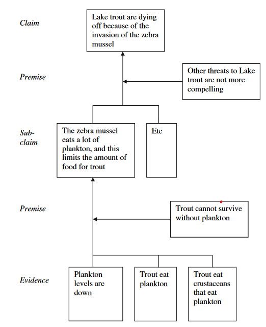
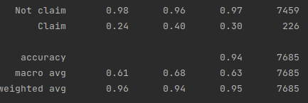
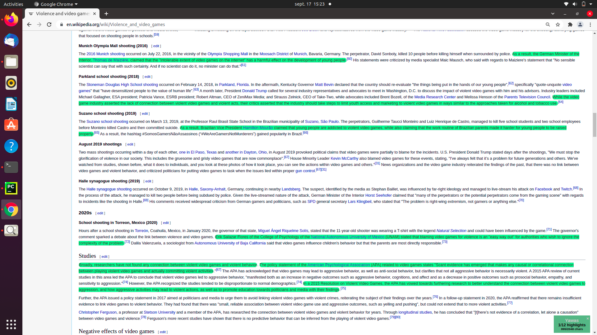

# ArgumentMining

ArgumentMining allows you to explore argumentation in texts, by detecting argument components as well as the relations between them.
Argument components detection is a stain needed for multiple NLP tasks, like fact checking, knowledge base population or source trustiness evaluation [2].
In the current version, the output machine learning model is trained and tested using Wikipedia articles. 

## Argument Model
Most of the proposed models for arguments components distinguish three types of components: conclusive claims, supportive claims (premises) and evidences.
The following picture [1] shows how these components can relate and form complex arguments. In their terminology, the authors of this picture use "claims" for conclusive claims and "premises" for supportive claims.
Currently argument mining detects both conclusive claims and supportive claims as "claims".

Source: Belland, B. R., Glazewski, K. D., & Richardson, J. C. (2008). A scaffolding framework to support the construction of evidence-based arguments among middle school students. Educational Technology Research and Development, 56(4), 401-422.

## How to use
To train and test a model (currently only trained on Wikipedia data), run: 

    pip install --r requierement.txt
    python classification.py

We are currently working on improving this procedure by adding arguments.

The resulted model will be able to classify sentences from a text as argument components (or not).

## Current results

These results are undermined because in the currently used dataset, not all claims are annotated but only those related with some specific topics. (Currently working on improving this).
Also results for evidences detections will be added this week.
You can see examples of the claims retrieved in the following picture. You can also use the generated model to do predictions with your own texts.

## Contribute
Please feel free to contribute or raise an issue.

## License
See LICENSE.md

## DATASETS
Before using a dataset, please check its specific licence.

### Scientific articles
The annotated scientific articles comes from AraucariaDB [], augmented by [] with claims annotations
https://www-archiv.tu-darmstadt.de/kdsl/images/frontiersarg2014_preprint.pdf

### Student essays
The annotated student essays dataset was created by [3] and [4]

### Wikipedia
The "Wikipedia datasets come from annotated Wikipedia article from the IBM Debater project [5].

## References

[1] Belland, B. R., Glazewski, K. D., & Richardson, J. C. (2008). A scaffolding framework to support the construction of evidence-based arguments among middle school students. Educational Technology Research and Development, 56(4), 401-422.

[2] Mensonides, J. C., Harispe, S., Montmain, J., & Thireau, V. (2019, September). Automatic Detection and Classification of Argument Components using Multi-task Deep Neural Network. In 3rd International Conference on Natural Language and Speech Processing.

[3] Stab, C., & Gurevych, I. (2014, August). Annotating argument components and relations in persuasive essays. In Proceedings of COLING 2014, the 25th international conference on computational linguistics: Technical papers (pp. 1501-1510).

[4] Stab, C., & Gurevych, I. (2017). Parsing argumentation structures in persuasive essays. Computational Linguistics, 43(3), 619-659.

[5] https://www.research.ibm.com/artificial-intelligence/project-debater/

