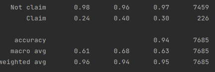
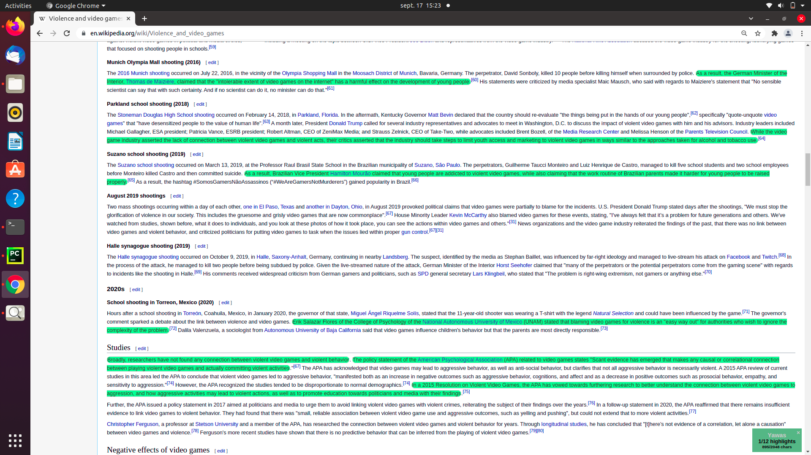

# ArgumentMining

Argument Mining allow you to explore argumentation in text, by detecting arguments components and relation between them.
Argument components detection is a stain needed for multiple NLP task, like fact checking, knowledge base population or source trustiness evaluation[2].
The current version is Trained and Tested using Wikipedia articles. 

## Argument Model
Most of the proposed models for arguments components distinguish three types of components: conclusive claims, supportive claims (premises) and evidence.
The following picture [1] show how these component can relates and form complex arguments, in their terminology authors uses claims for conclusive claims and premises for supportive claims.
Currently argument mining detects both conclusive claims and supportive claims as "claims".

Source: Belland, B. R., Glazewski, K. D., & Richardson, J. C. (2008). A scaffolding framework to support the construction of evidence-based arguments among middle school students. Educational Technology Research and Development, 56(4), 401-422.

## How to use
To train and test a model (currently only trained on Wikipedia data), run: (currently working on improving this procedure by adding arguments)

    python classification.py

The resulted model will be able to classify sentences from text

## Current results

These results are undermined by the fact that not all claims are but only those related with some topics. (Currently working on improving this).
Also results for claims will be added this week.
You can see example of the claims retrieved in the following picture, or use the model to predict with your own texts.

## Contribute
Please feel free to contribute or raise an issue.

## License
We have to choose a licence for this

## DATASETS
Before using a dataset, please check its specific licence.

### Scientific articles
The annotated scientific articles comes from AraucariaDB [], augmented by [] with claims annotations
https://www-archiv.tu-darmstadt.de/kdsl/images/frontiersarg2014_preprint.pdf

### Student essays
The annotated student essays dataset was created by [3] and [4]

### Wikipedia
The "Wikipedia datasets come from annotated Wikipedia article from the IBM Debater project [5].

[1] Belland, B. R., Glazewski, K. D., & Richardson, J. C. (2008). A scaffolding framework to support the construction of evidence-based arguments among middle school students. Educational Technology Research and Development, 56(4), 401-422.

[2] Mensonides, J. C., Harispe, S., Montmain, J., & Thireau, V. (2019, September). Automatic Detection and Classification of Argument Components using Multi-task Deep Neural Network. In 3rd International Conference on Natural Language and Speech Processing.

[3] Stab, C., & Gurevych, I. (2014, August). Annotating argument components and relations in persuasive essays. In Proceedings of COLING 2014, the 25th international conference on computational linguistics: Technical papers (pp. 1501-1510).

[4] Stab, C., & Gurevych, I. (2017). Parsing argumentation structures in persuasive essays. Computational Linguistics, 43(3), 619-659.

[5] https://www.research.ibm.com/artificial-intelligence/project-debater/

